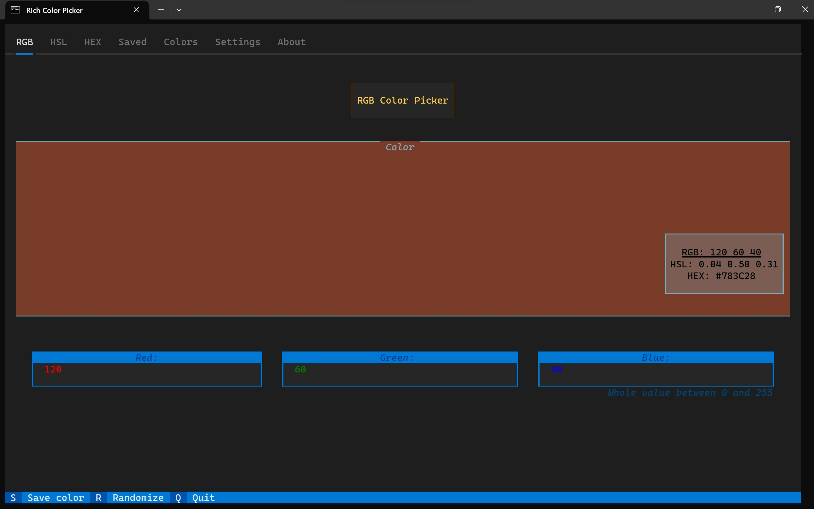
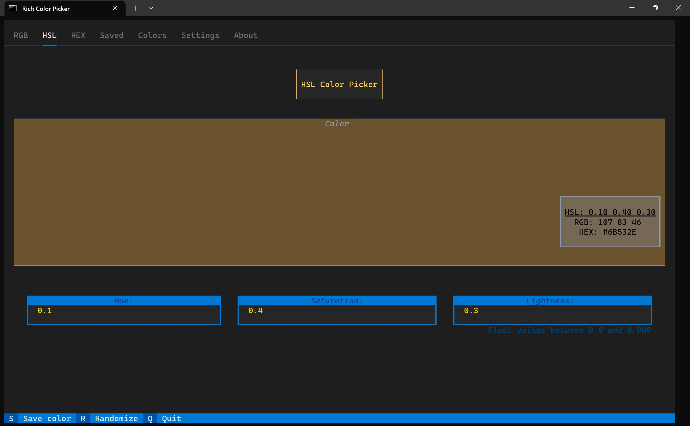
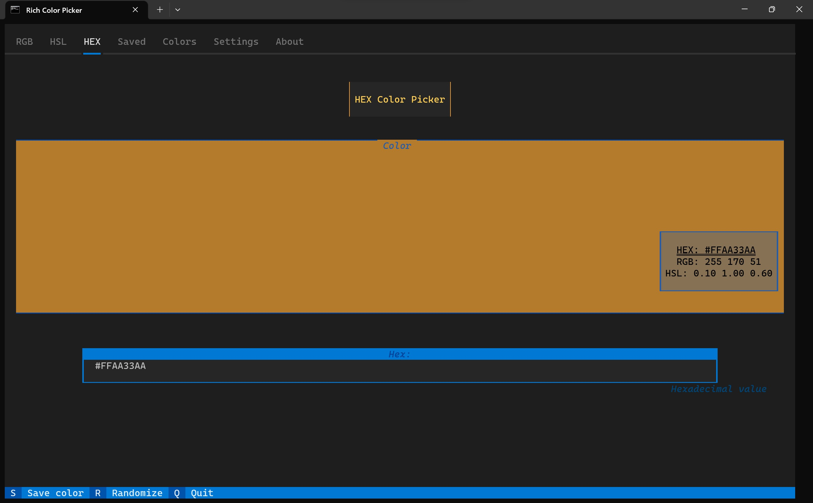
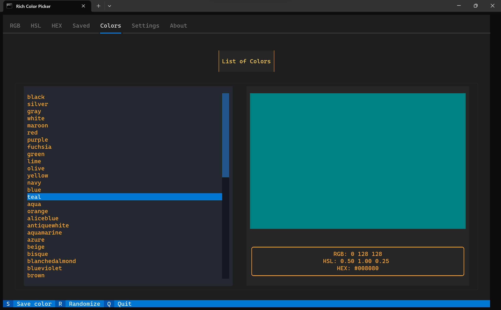
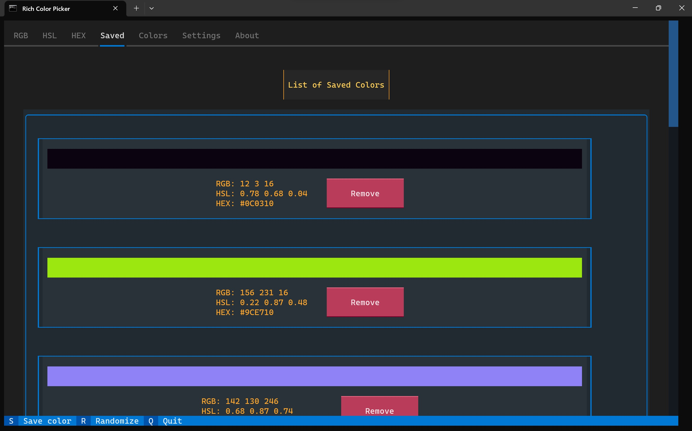
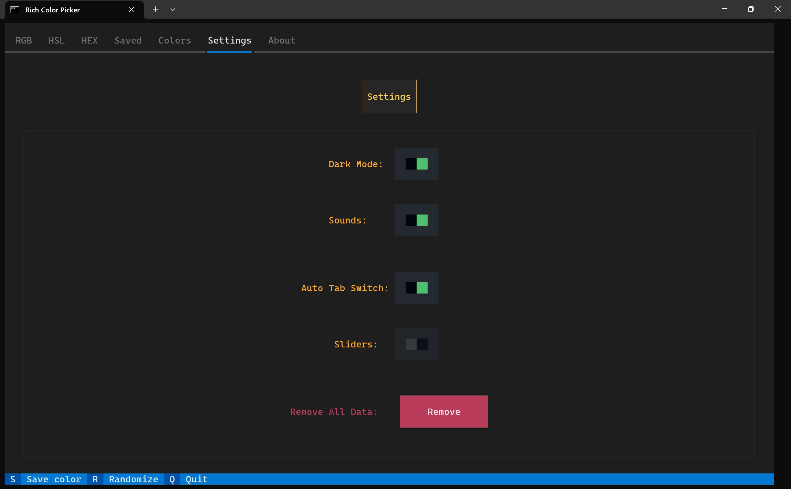

# Rich Color Picker
#### Terminal based color picker with rich color palette.

---

*Rich Color Picker* provides easy to use functions that let You find and manage Your colors.

* How to download and install
  - If You already didn't install [Python](https://www.python.org/downloads/). Recommended Python version is [3.8](https://www.python.org/downloads/release/python-380/)
  - From PyPi:
    * To download *Rich Color Picker* from [PyPi](https://pypi.org/project/rcp-colors/) simply type in the terminal: `pip install rich-colors`.
  - From Github:
    * When downloading from Github You need to first install setuptools with `pip install setuptools`.
    * Download all files from the repository, then open the terminal in the same file that `setup.py` file is in and type: `python setup.py install` or `python3 setup.py install` (on linux You might need to use sudo).
* Ho to start
  - After installation, type in the terminal `rcp-colors`. This will start the app.
* Functions
  - Video showing *Rich Color Picker* functionality (Click the miniature to open Youtube video)
    * 
  - Find color from RGB
    * 
  - Find color from HSL
    * 
  - Find color from HEX
    * 
  - Quickly view most important colors in a list
    * 
  - Manage Your saved colors
    * 
    * You can add Your color to saved by clicking `S` button. Colors will be saved to data file, so when You start the app later again, Your colors will be still there.
  - Change Your settings
    * 
    * Settings will be saved when You start *Rich Color Picker* later again.
  - Additional functions:
    * Randomize: Press 'R' button to get random color.

___

Shout out to [Textualize](https://github.com/Textualize/textual) discord community. Big thanks to *davep* for helping me to write this program!
